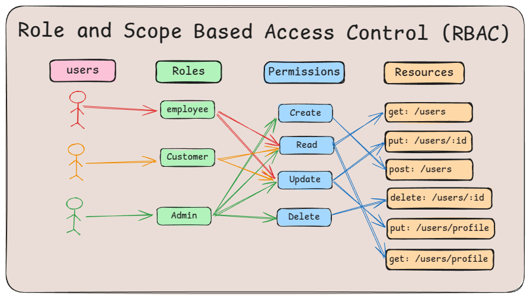

# Go-RBAC: Role and Scope Based Access Control Implementation

This repository demonstrates how to implement **Role and Scope-Based Access Control (RBAC)** in a Go application using **Redis**, **MySQL**, and the Echo framework.

<p align="center">
  
</p>

---

## Features 🚀

- **Role-Based Access Control**: Restricts access to resources based on user roles (e.g., Admin, Employee, Customer).
- **Scope-Based Permissions**: Adds granular permissions for specific operations (e.g., `users:read`, `users:create`).
- **Redis Integration**: Caches user roles, scopes and blacklisted access.
- **MySQL Integration**: Stores user and role data persistently.
- **Secure Authentication**: Includes endpoints for user registration and login.

---

## Prerequisites 📋

- **Go**: Version 1.21 or higher
- **MySQL**: For storing user data
- **Redis**: For caching role and scope data
- **Docker**: For containerization (optional)

---

## Project Structure 📂
```bash
├── cmd
│   └── main.go                # Application entry point
├── config
│   ├── config.go              # Configuration loader and management logic
│   └── config.yaml            # Configuration file for environment variables and application settings
├── internal
│   ├── {sub_domain}           # Grouped by subdomains or modules
│   │   ├── usecase            # Application-specific business logic
│   │   │   └── usecase.go     # Implementation of use cases for the subdomain
│   │   ├── entities           # Core domain entities
│   │   │   └── entity.go      # Definitions of core domain entities
│   │   ├── dtos               # Data Transfer Objects for request/response payloads
│   │   │   └── dtos.go        # DTO definitions for input/output operations
│   │   ├── repository         # Persistence and database layer
│   │   │   └── repository.go  # Implementation of repository interfaces
│   │   ├── delivery           # Delivery layer (e.g., HTTP handlers, routes)
│   │   │   ├── handlers.go    # Request/response handlers for the subdomain
│   │   │   └── routes.go      # Route definitions for the subdomain
│   │   ├── usecase.go         # Interface for the use case layer
│   │   ├── repository.go      # Interface for the repository layer
│   │   ├── delivery.go        # Interface for the delivery layer
├── middleware                 # Custom middleware (e.g., RBAC, logging, authentication)
├── pkg                        # Shared libraries or utility functions
│   ├── redis                  # Utilities for Redis interactions
│   ├── constants              # Application-wide constants and enumerations
│   ├── utils                  # General utility functions and helpers
│   ├── datasources            # Data source configuration and initialization (e.g., MySQL, Redis)
│   └── rbac                   # Role-based access control utilities and logic
├── migrations                 # Database migration files
├── infrastructure             # Infrastructure setup and configurations
│   └── docker-compose.yml     # Docker Compose configuration for service orchestration
├── docs                       # Documentation (e.g., API specifications, design documents)
├── tests                      # Testing suite for various layers
│   ├── e2e                    # End-to-end tests
│   ├── unit                   # Unit tests
│   └── integration            # Integration tests
├── README.md                  # Project documentation
└── Makefile                   # Build and automation instructions for the project
```

## Endpoints and Access Requirements 🌐
| Endpoint         | HTTP Method | Scope           | Roles with Access      | Description                              |
|-------------------|-------------|-----------------|------------------------|------------------------------------------|
| `/users`         | `GET`       | `users:read`    | `Admin`, `Employee`    | Retrieve the list of users.              |
| `/users/:id`     | `PUT`       | `users:update`  | `Admin`, `Employee`    | Update user details.                     |
| `/users`         | `POST`      | `users:create`  | `Admin`                | Create a new user.                       |
| `/users/:id`     | `DELETE`    | `users:delete`  | `Admin`                | Delete a user.                           |
| `/profile`       | `GET`       | `profile:read`  | `Customer`, `Employee` | Retrieve the authenticated user's profile.|
| `/profile`       | `PUT`       | `profile:update`| `Customer`, `Employee` | Update the authenticated user's profile. |
---

## Installation & Setup 🛠️

### Clone the Repository
```bash
git clone https://github.com/DoWithLogic/go-rbac.git
cd go-rbac
```

### Run the Application
The make run command will:
- Start the Docker containers for Redis and the database (if not already running).
- Apply any pending database migrations.
- Start the application.
```bash
make run
```


## Example Implementation 🧑‍💻
### Middleware for Role Validation
```bash
func (m *Middleware) RolesMiddleware(roles ...constants.UserRole) echo.MiddlewareFunc {
	return func(next echo.HandlerFunc) echo.HandlerFunc {
		return func(c echo.Context) error {
			jwtData, ok := c.Get(constants.AuthCredentialContextKey.String()).(*security.JWTClaims)
			if !ok {
				return response.ErrorBuilder(app_errors.Forbidden(app_errors.ErrAccessDenied)).Send(c)
			}

			if !m.hasRequiredRole(jwtData.Role, roles) {
				return response.ErrorBuilder(app_errors.Forbidden(app_errors.ErrAccessDenied)).Send(c)
			}

			// Store the token claims in the request context for later use
			c.Set(constants.AuthCredentialContextKey.String(), jwtData)

			return next(c)
		}
	}
}

func (m *Middleware) hasRequiredRole(userRole constants.UserRole, roles []constants.UserRole) bool {
	for _, r := range roles {
		if r == userRole {
			return true
		}
	}
	return false
}
```
### Middleware for Scope Validation
```bash
func (m *Middleware) PermissionsMiddleware(permissions ...constants.Permission) echo.MiddlewareFunc {
	return func(next echo.HandlerFunc) echo.HandlerFunc {
		return func(c echo.Context) error {
			jwtData, ok := c.Get(constants.AuthCredentialContextKey.String()).(*security.JWTClaims)
			if !ok {
				return response.ErrorBuilder(app_errors.Forbidden(app_errors.ErrAccessDenied)).Send(c)
			}

			if !m.hasRequiredPermission(jwtData.Permissions, permissions) {
				return response.ErrorBuilder(app_errors.Forbidden(app_errors.ErrAccessDenied)).Send(c)
			}

			c.Set(constants.AuthCredentialContextKey.String(), jwtData)

			return next(c)
		}
	}
}

func (m *Middleware) hasRequiredPermission(userPermissions, requiredPermissions []constants.Permission) bool {
	requiredPermissionsMap := make(map[constants.Permission]bool)
	for _, permission := range requiredPermissions {
		requiredPermissionsMap[permission] = true
	}

	for _, permission := range userPermissions {
		if requiredPermissionsMap[permission] {
			return true
		}
	}

	return false
}
```

### Assign Middleware to Endpoints
```bash
func MapUserRoutes(g echo.Group, h users.Handlers, mw *middlewares.Middleware) {
	users := g.Group("/users", mw.JWTMiddleware())
	users.POST("", h.CreateUserHandler, mw.RolesMiddleware(constants.AdminUserRole), mw.PermissionsMiddleware(constants.UsersCreatePermission))
}
```

## Configuration ⚙️
```bash
App:
  Name: "go-rbac"
  Version: "0.0.1"
  Scheme: "http"
  Host: "localhost:3002"
  Environment: local #local,development,staging,production
  
Server:
  Port: "3002"
  Debug: true
  TimeZone: "Asia/Jakarta"

Database:
  Host: "127.0.0.1"
  Port: "3306"
  DBName: "go_rbac"
  UserName: "root"
  Password: "pwd"
  Debug: true

Security:
  JWT:
    Key: "95476ff7-c7b2-49d7-853e-322b6f983914"
    ExpiredInSecond: 3600
```

## API Documentation 📑

### Overview
This repository provides a set of API endpoints for managing roles, permissions, and user access. The API allows you to create, update, retrieve, and delete roles, permissions, and role-permission mappings. It also supports secure JWT-based authentication to enforce role-based access control.

### Explore Swagger Documentation
For a detailed description of all the available API endpoints, request/response formats, and examples, explore our Swagger documentation at the following link:

- [Swagger Documentation](http://localhost:3002/swagger/index.html)

The Swagger documentation will provide detailed information on:
- **Available Endpoints**: All API routes for managing users, roles, permissions, and access control.
- **Request/Response Formats**: Detailed format for the expected input and output of each API endpoint.
- **Authentication**: How to authenticate requests using JWT tokens.
- **Role and Permission Validation**: How roles and permissions are validated for each endpoint.

## License 📄
This project is licensed under the [MIT License](LICENSE). See the LICENSE file for details.

## Contributing 🤝
Feel free to submit pull requests or open issues to improve this project. Contributions are always welcome!
```bash
This `README.md` file includes the project overview, structure, setup instructions, endpoint details, and example implementations. Let me know if you'd like to add or modify any sections!
```

